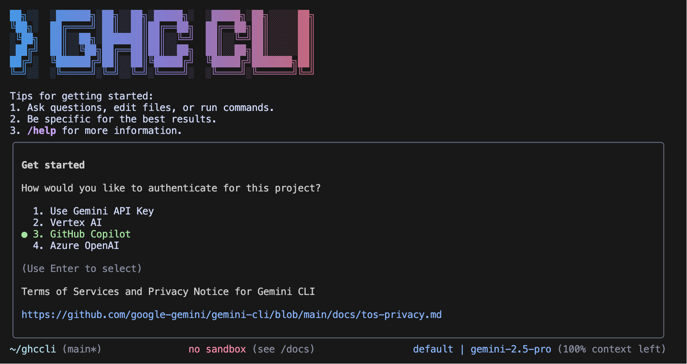

# Github Copilot CLI

[](https://github.com/plusplusoneplusplus/ghccli/actions/workflows/ci.yml)



This repository contains GHCCLI, an enhanced command-line AI workflow tool that connects to your
tools, understands your code and accelerates your workflows. GHCCLI is built on top of the Gemini CLI
with additional customizations and features.

With GHCCLI you can:

- Query and edit large codebases.
- Generate new apps from PDFs or sketches, using multimodal AI capabilities.
- Automate operational tasks, like querying pull requests or handling complex rebases.
- Use tools and MCP servers to connect new capabilities, including media generation tools
- Ground your queries with integrated search capabilities.
- Access multiple AI providers including Gemini, GitHub Copilot, and OpenAI.

## Quickstart

You have multiple options to install GHCCLI.

### With Node

1. **Prerequisites:** Ensure you have [Node.js version 20](https://nodejs.org/en/download) or higher installed.
2. **Install from source:** Clone and build the CLI:

   ```bash
   git clone https://github.com/plusplusoneplusplus/ghccli.git
   cd ghccli
   npm install
   npm run build
   ```

   Then, run the CLI from the project directory:

   ```bash
   npm start
   ```

   Or install it globally:

   ```bash
   npm install -g .
   ghccli
   ```

### Alternative Installation Methods

#### With Homebrew (if available)

1. **Prerequisites:** Ensure you have [Homebrew](https://brew.sh/) installed.
2. **Install the CLI:** Execute the following command in your terminal:

   ```bash
   brew install ghccli
   ```

#### System Requirements

- Node.js version 20 or higher
- macOS, Linux, or Windows

## 📋 Key Features

### Code Understanding & Generation

- Query and edit large codebases
- Generate new apps from PDFs, images, or sketches using multimodal capabilities
- Debug issues and troubleshoot with natural language

### Automation & Integration

- Automate operational tasks like querying pull requests or handling complex rebases
- Use MCP servers to connect new capabilities, including [media generation with Imagen, Veo or Lyria](https://github.com/GoogleCloudPlatform/vertex-ai-creative-studio/tree/main/experiments/mcp-genmedia)
- Run non-interactively in scripts for workflow automation

### Advanced Capabilities

- Ground your queries with built-in [Google Search](https://ai.google.dev/gemini-api/docs/grounding) for real-time information
- Conversation checkpointing to save and resume complex sessions
- Custom context files (GEMINI.md) to tailor behavior for your projects

### GitHub Integration

Integrate Gemini CLI directly into your GitHub workflows with [**Gemini CLI GitHub Action**](https://github.com/google-github-actions/run-gemini-cli):

- **Pull Request Reviews**: Automated code review with contextual feedback and suggestions
- **Issue Triage**: Automated labeling and prioritization of GitHub issues based on content analysis
- **On-demand Assistance**: Mention `@gemini-cli` in issues and pull requests for help with debugging, explanations, or task delegation
- **Custom Workflows**: Build automated, scheduled and on-demand workflows tailored to your team's needs

## 🔐 Authentication Options

Choose the authentication method that best fits your needs:

### Option 1: OAuth login (Using your Google Account)

**✨ Best for:** Individual developers as well as anyone who has a Gemini Code Assist License. (see [quota limits and terms of service](https://cloud.google.com/gemini/docs/quotas) for details)

**Benefits:**

- **Free tier**: 60 requests/min and 1,000 requests/day
- **Gemini 2.5 Pro** with 1M token context window
- **No API key management** - just sign in with your Google account
- **Automatic updates** to latest models

#### Start Gemini CLI, then choose OAuth and follow the browser authentication flow when prompted

   ```bash
   ghccli
   ```

#### With NPX (upstream Gemini CLI)

For the original Gemini CLI functionality:

   ```bash
   npx https://github.com/google-gemini/gemini-cli
   ```

### Common Configuration steps

3. **Pick a color theme**
4. **Authenticate:** When prompted, choose your preferred AI provider and sign in. GHCCLI supports multiple authentication methods including Google accounts, GitHub Copilot, and OpenAI.

You are now ready to use GHCCLI!

### Use a Gemini API key:

The Gemini API provides a free tier with [100 requests per day](https://ai.google.dev/gemini-api/docs/rate-limits#free-tier) using Gemini 2.5 Pro, control over which model you use, and access to higher rate limits (with a paid plan):

1. Generate a key from [Google AI Studio](https://aistudio.google.com/apikey).
2. Set it as an environment variable in your terminal. Replace `YOUR_API_KEY` with your generated key.

```bash
# Get your key from https://aistudio.google.com/apikey
export GEMINI_API_KEY="YOUR_API_KEY"
gemini
```
```bash
# Get your key from https://aistudio.google.com/apikey
export GEMINI_API_KEY="YOUR_API_KEY"
gemini
```

### Option 3: Vertex AI
### Option 3: Vertex AI

**✨ Best for:** Enterprise teams and production workloads
**✨ Best for:** Enterprise teams and production workloads

**Benefits:**
**Benefits:**

- **Enterprise features**: Advanced security and compliance
- **Scalable**: Higher rate limits with billing account
- **Integration**: Works with existing Google Cloud infrastructure
- **Enterprise features**: Advanced security and compliance
- **Scalable**: Higher rate limits with billing account
- **Integration**: Works with existing Google Cloud infrastructure

   ```bash
   export GOOGLE_API_KEY="YOUR_API_KEY"
   export GOOGLE_GENAI_USE_VERTEXAI=true
   ```

3. (Optionally) Add a billing account on your project to get access to [higher usage limits](https://cloud.google.com/vertex-ai/generative-ai/docs/quotas)

### Use GitHub Copilot:

The GitHub Copilot integration provides access to GPT-4 and other models through your GitHub Copilot subscription:

1. **Prerequisites:** You need an active [GitHub Copilot subscription](https://github.com/features/copilot) (individual, business, or enterprise).
2. **Authentication:** The CLI will guide you through GitHub's OAuth flow:

   - Just select "GitHub Copilot" in the authentication menu
   - The CLI will display a device code and verification URL
   - Visit the URL and enter the code to authorize

### Use OpenAI directly:

Connect directly to OpenAI's API or OpenAI-compatible APIs:

1. **Prerequisites:** You need an OpenAI API key from your [OpenAI account](https://platform.openai.com/api-keys).
2. **Configuration:** Set the required environment variables:

   ```bash
   # Required: Your OpenAI API key
   export OPENAI_API_KEY="sk-your-openai-api-key"
   
   # Optional: Custom base URL (defaults to OpenAI)
   export OPENAI_BASE_URL="https://api.openai.com/v1"
   
   # Optional: Default model (defaults to gpt-4o)
   export OPENAI_MODEL="gpt-4"
   ```

3. **Authentication:** Select "OpenAI" in the authentication menu when starting the CLI.

For other authentication methods, including Google Workspace accounts, see the [authentication](./docs/cli/authentication.md) guide.

## Examples

Once the CLI is running, you can start interacting with AI from your shell.

You can start a project from a new directory:

```sh
cd new-project/
ghccli
> Write me a Discord bot that answers questions using a FAQ.md file I will provide
```

Or work with an existing project:

```sh
git clone https://github.com/plusplusoneplusplus/ghccli
cd ghccli
ghccli
> Give me a summary of all of the changes that went in yesterday
````
````

## 🔗 GitHub Integration
## 🔗 GitHub Integration

Integrate Gemini CLI directly into your GitHub workflows with the [**Gemini CLI GitHub Action**](https://github.com/google-github-actions/run-gemini-cli). Key features include:

- **Pull Request Reviews**: Automatically review pull requests when they're opened.
- **Issue Triage**: Automatically triage and label GitHub issues.
- **On-demand Collaboration**: Mention `@gemini-cli` in issues and pull requests for assistance and task delegation.
- **Custom Workflows**: Set up your own scheduled tasks and event-driven automations.

## Popular tasks

### Explore a new codebase

Start by `cd`ing into an existing or newly-cloned repository and running `ghccli`.

```text
> Describe the main pieces of this system's architecture.
```

```text
> What security mechanisms are in place?
```

```text
> Provide a step-by-step dev onboarding doc for developers new to the codebase.
```

```text
> Summarize this codebase and highlight the most interesting patterns or techniques I could learn from.
```

```text
> Identify potential areas for improvement or refactoring in this codebase, highlighting parts that appear fragile, complex, or hard to maintain.
```

```text
> Which parts of this codebase might be challenging to scale or debug?
```

```text
> Generate a README section for the [module name] module explaining what it does and how to use it.
```

```text
> What kind of error handling and logging strategies does the project use?
```

```text
> Which tools, libraries, and dependencies are used in this project?
```

### Work with your existing code

```text
> @github List my open pull requests
> @slack Send a summary of today's commits to #dev channel
> @database Run a query to find inactive users
```

See the [MCP Server Integration guide](./docs/tools/mcp-server.md) for setup instructions.

## 🤝 Contributing

We welcome contributions! Gemini CLI is fully open source (Apache 2.0), and we encourage the community to:

- Report bugs and suggest features
- Improve documentation
- Submit code improvements
- Share your MCP servers and extensions

See our [Contributing Guide](./CONTRIBUTING.md) for development setup, coding standards, and how to submit pull requests.

Check our [Official Roadmap](https://github.com/orgs/google-gemini/projects/11/) for planned features and priorities.

## 📖 Resources

- **[Official Roadmap](./ROADMAP.md)** - See what's coming next
- **[NPM Package](https://www.npmjs.com/package/@google/gemini-cli)** - Package registry
- **[GitHub Issues](https://github.com/google-gemini/gemini-cli/issues)** - Report bugs or request features
- **[Security Advisories](https://github.com/google-gemini/gemini-cli/security/advisories)** - Security updates
> @github List my open pull requests
> @slack Send a summary of today's commits to #dev channel
> @database Run a query to find inactive users
```

See the [MCP Server Integration guide](./docs/tools/mcp-server.md) for setup instructions.

## 🤝 Contributing

We welcome contributions! Gemini CLI is fully open source (Apache 2.0), and we encourage the community to:

- Report bugs and suggest features
- Improve documentation
- Submit code improvements
- Share your MCP servers and extensions

See our [Contributing Guide](./CONTRIBUTING.md) for development setup, coding standards, and how to submit pull requests.

Check our [Official Roadmap](https://github.com/orgs/google-gemini/projects/11/) for planned features and priorities.

## 📖 Resources

- **[Official Roadmap](./ROADMAP.md)** - See what's coming next
- **[NPM Package](https://www.npmjs.com/package/@google/gemini-cli)** - Package registry
- **[GitHub Issues](https://github.com/google-gemini/gemini-cli/issues)** - Report bugs or request features
- **[Security Advisories](https://github.com/google-gemini/gemini-cli/security/advisories)** - Security updates

### Uninstall

See the [Uninstall Guide](docs/Uninstall.md) for removal instructions.
See the [Uninstall Guide](docs/Uninstall.md) for removal instructions.

## 📄 Legal
## 📄 Legal

For details on the terms of service and privacy notice applicable to your use of GHCCLI, see the [Terms of Service and Privacy Notice](./docs/tos-privacy.md).

---
---

Please see our [security disclosure process](SECURITY.md). All [security advisories](https://github.com/plusplusoneplusplus/ghccli/security/advisories) are managed on Github.

## Acknowledgments

GHCCLI is built on top of the excellent [Gemini CLI](https://github.com/google-gemini/gemini-cli) project by Google. We extend our gratitude to the original authors and contributors.
